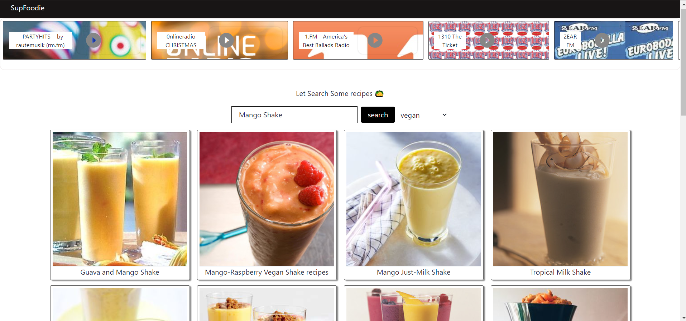
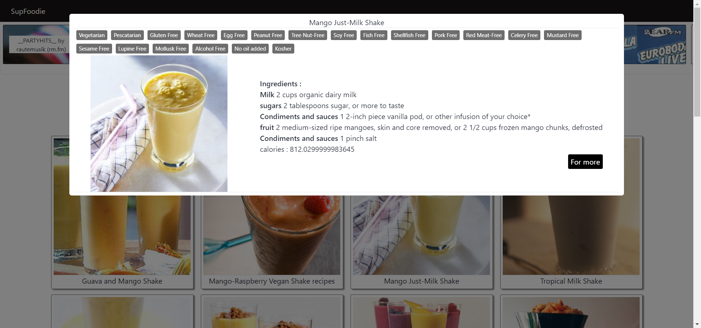

[![Contributors][contributors-shield]][contributors-url]
[![Forks][forks-shield]][forks-url]
[![Stargazers][stars-shield]][stars-url]
[![Issues][issues-shield]][issues-url]
[![MIT License][license-shield]][license-url]


<!-- PROJECT LOGO -->
<br />
<p align="center">
  <a href="">
    
  </a>

  <h3 align="center">SuperFoodie</h3>

  <p align="center">
     Enjoy summer with ur Fav food and Music 😍🤩. 
    <br />
    <a href="https://tejas-ladhani.github.io/superFoodie/">View Demo</a>
    ·
    <a href="https://github.com/Tejas-Ladhani/superFoodie/issues">Report Bug</a>
    ·
  </p>
</p>


<!-- ABOUT THE PROJECT -->
## About The Project
A web application where you can listen to FM music/Radio and find your favorite recipes at the same time. What better thing to do on a hot summer day😎.





### Built With

* [ReactJs](https://reactjs.org/)
* [radio-browser-api](https://www.npmjs.com/package/radio-browser-api)
* [react-h5-audio-player](https://www.npmjs.com/package/react-h5-audio-player)
* [edamam food api](https://developer.edamam.com/)


<!-- GETTING STARTED -->
## Getting Started

1. Clone the repo
   ```sh
   git clone https://github.com/Tejas-Ladhani/superFoodie.git
   ```
2. Install NPM packages
   ```sh
   npm install
   ```
   or

    ```sh
   yarn installl
   ```

3. Create edamam app on official website & get API keys from [developer.edamam.com/](https://developer.edamam.com/)

4. Enter your API in `/src/containers/recipe/index.js`
   ```JS
  const YOUR_APP_ID = 'ENTER YOUR API';
  const YOUR_APP_KEY = 'ENTER YOUR API';
   ```

5. In the project directory, you can run:

  * `npm start`

      Runs the app in the development mode.\
      Open [http://localhost:3000](http://localhost:3000) to view it in the browser.

      The page will reload if you make edits.\
      You will also see any lint errors in the console.

  * `npm test`

      Launches the test runner in the interactive watch mode.\
      See the section about [running tests](https://facebook.github.io/create-react-app/docs/running-tests) for more information.

  * `npm run build`

      Builds the app for production to the `build` folder.\
      It correctly bundles React in production mode and optimizes the build for the best performance.

      The build is minified and the filenames include the hashes.\
      Your app is ready to be deployed!


<!-- ROADMAP -->
## Roadmap

See the [open issues](https://github.com/Tejas-Ladhani/superFoodie/issues) for a list of proposed features (and known issues).


<!-- CONTRIBUTING -->
## Contributing

Contributions are what make the open source community such an amazing place to be learn, inspire, and create. Any contributions you make are **greatly appreciated**.

1. Fork the Project
2. Create your Feature Branch (`git checkout -b feature/AmazingFeature`)
3. Commit your Changes (`git commit -m 'Add some AmazingFeature'`)
4. Push to the Branch (`git push origin feature/AmazingFeature`)
5. Open a Pull Request


<!-- LICENSE -->
## License

Distributed under the MIT License. See `LICENSE` for more information.


<!-- MARKDOWN LINKS & IMAGES -->
<!-- https://www.markdownguide.org/basic-syntax/#reference-style-links -->
[contributors-shield]: https://img.shields.io/github/contributors/Tejas-Ladhani/superFoodie.svg?style=for-the-badge
[contributors-url]:https://github.com/Tejas-Ladhani/superFoodie/graphs/contributors
[forks-shield]: https://img.shields.io/github/forks/Tejas-Ladhani/superFoodie.svg?style=for-the-badge
[forks-url]:https://github.com/Tejas-Ladhani/superFoodie/network/members
[stars-shield]: https://img.shields.io/github/stars/Tejas-Ladhani/superFoodie.svg?style=for-the-badge
[stars-url]:https://github.com/Tejas-Ladhani/superFoodie/stargazers
[issues-shield]: https://img.shields.io/github/issues/Tejas-Ladhani/superFoodie.svg?style=for-the-badge
[issues-url]:https://github.com/Tejas-Ladhani/superFoodie/issues
[license-shield]: https://img.shields.io/github/license/Tejas-Ladhani/superFoodie.svg?style=for-the-badge
[license-url]:https://github.com/Tejas-Ladhani/superFoodie/blob/master/LICENSE.txt
[product-screenshot]: images/screenshot.png